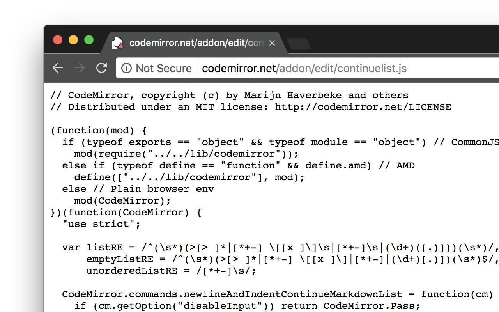
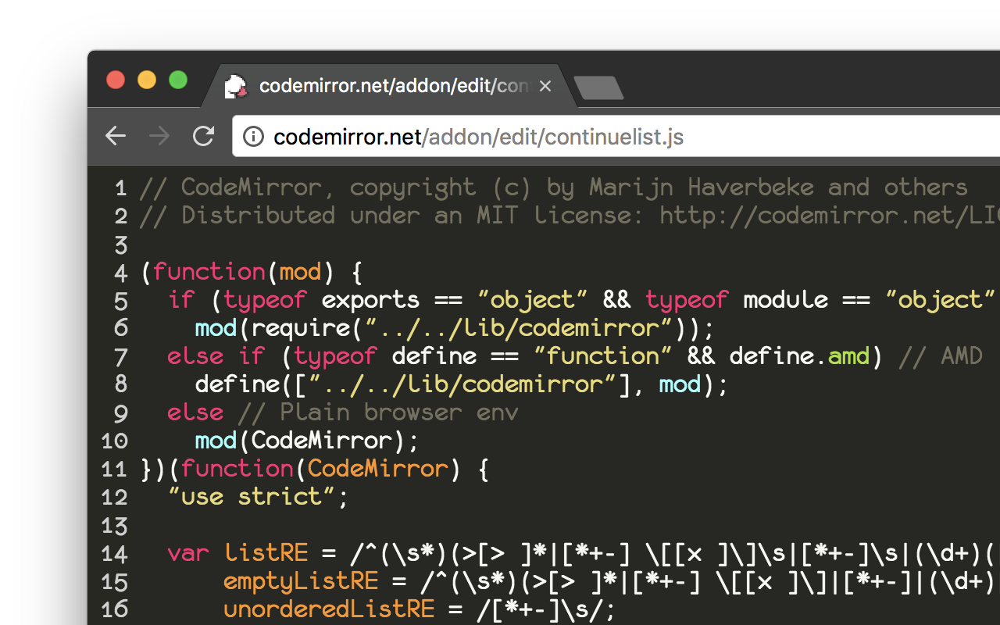

# ColorCode

The Cross-Browser Syntax Highlighter Extension! 🎉

- [Installation](#installation)
- [Features](#features)
- [Known Issues](#known-issues)
- [Development Notes](#development-notes)
    - [Roadmap](#todo)
- [Related/Credits](#relatedcredits)
- [License](#license)

## Installation

* For Firefox: https://addons.mozilla.org/en-US/firefox/addon/colorcode/
* For Chrome: https://chrome.google.com/webstore/detail/colorcode/aokmjdppkdpijecgoclkhggkhijjhpbd

Before ColorCode...

After ColorCode!

## Features

* Highlights as many files as CodeMirror supports ([which is a lot!](http://codemirror.net/mode/))
* You can choose between heaps of themes
* You can customise the experience (font family, font size, line numbers, etc.)
* If you want, you can even edit the file right in your browser! (disable `Read Only` in options)
* You'll stop squinting at black on white code in the browser :+1:

## Known Issues

* *Firefox:* CSP 'sandbox' directive prevents content scripts from matching, due to unique origin [#1](https://github.com/acheronfail/ColorCode/issues/1)

## Development Notes

I'll be writing up some more coherent notes on development soon, but it's rather simple anyway.

Download & Build:

* `git clone https://github.com/acheronfail/ColorCode.git`
* `cd ColorCode`
* `npm install`
* `npm run build-deps`
* `npm run build`

Develop with live-reload (after building at least once):

* `npm run firefox-watch`
* `npm run chrome-watch`
* `npm run opera-watch`

Prepare for distribution (after building at least once):

* `npm run dist`

### TODO

- [x] create icon
- [x] add some fonts
- [x] git-submodule codemirror in order to stay up to date
    + make a build script to copy files over
- [ ] test with opera
- [ ] test with various different files extensions and highlighting types
- [ ] beautify json/js files
- [ ] add in find commands (to be able to search code)
- [ ] increase viewport sizing? (slight flicker on scroll)
- [ ] uglify source in prod (doesn't work with `async` functions atm, `"transform-async-to-generator"` ?)
- [ ] submit to app stores

## Related/Credits

* This extension was originally inspired by https://github.com/tsenart/sight
* Have a look at CodeMirror - it's the best http://codemirror.net/

## License

[MIT](LICENSE.md)
